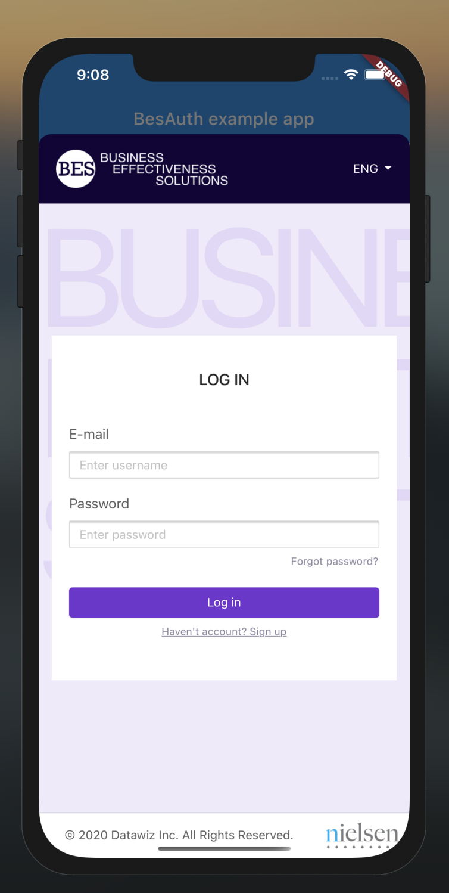

<h1 align="center">flutter_bes_auth</h1>

<h6 align="center">
 Plugin for simple integration with "BES" authorization.
</h6>

<p align="center">
  
</p>

# Simple Auth Example

```dart
void main() async {
  BesAuth besAuth = BesAuth(
    serviceUrl: "YOURE",
    redirectPath: "YOURE_REDIRECT_PATH",
    clientId: "YOURE_CLIENT_ID",
    clientSecret: "YOURE_CLIENT_SECRET",
  );

  BesSession? session = await besAuth.authenticate();

  print(session); // {scope: "SCOPE", expires_in: "EXPIRES_IN", token_type: "TOKEN_TYPE", access_token: "ACCESS_TOKEN", refresh_token: "REFRESH_TOKEN"}
}
```

# SSO via system browser

Starting with `0.1.0` the login flow is no longer rendered inside an
in-app `WebView`. Instead it opens in the system browser
(`ASWebAuthenticationSession` on iOS, Chrome Custom Tabs / Auth Tab on
Android). This is required for SAML SSO with Google / Microsoft / etc.
to reuse the existing browser session and avoid asking the user for
credentials on every login.

The redirect URL used by the plugin is `app://<redirectPath>` (the
scheme is the constant `app`). The consuming app **must** register that
scheme so the OS can hand the redirect back to Flutter.

### iOS

Add to your app's `ios/Runner/Info.plist`:

```xml
<key>CFBundleURLTypes</key>
<array>
  <dict>
    <key>CFBundleTypeRole</key>
    <string>Editor</string>
    <key>CFBundleURLName</key>
    <string>bes_auth_callback</string>
    <key>CFBundleURLSchemes</key>
    <array>
      <string>app</string>
    </array>
  </dict>
</array>
```

Minimum deployment target: **iOS 12.0**.

### Android

Add the callback activity to your app's
`android/app/src/main/AndroidManifest.xml` (inside `<application>`):

```xml
<activity
    android:name="com.linusu.flutter_web_auth_2.CallbackActivity"
    android:exported="true"
    android:taskAffinity="">
  <intent-filter android:label="flutter_web_auth_2">
    <action android:name="android.intent.action.VIEW" />
    <category android:name="android.intent.category.DEFAULT" />
    <category android:name="android.intent.category.BROWSABLE" />
    <data android:scheme="app" />
  </intent-filter>
</activity>
```

Minimum SDK: **API 21** (Android 5.0).

### Logout

`BesAuth.logout(session)` revokes the access token on the BES server.
It intentionally does **not** clear the system browser's cookies — that
is what makes the next login silent and is the desired behavior for
SAML SSO. If you need to force the user to re-enter their IdP
credentials (e.g. for an account switch), call your IdP's `SingleLogout`
endpoint in the system browser as a separate step.

# Flutter Example

```dart
import 'package:bes_auth_flutter/bes_auth_flutter.dart';
import 'package:flutter/material.dart';

BesAuth besAuth = BesAuth(
  serviceUrl: "YOURE",
  redirectPath: "YOURE_REDIRECT_PATH",
  clientId: "YOURE_CLIENT_ID",
  clientSecret: "YOURE_CLIENT_SECRET",
);

void main() {
  runApp(MyApp());
}

class MyApp extends StatelessWidget {
  const MyApp({Key? key}) : super(key: key);

  @override
  Widget build(BuildContext context) {
    return MaterialApp(
      theme: ThemeData(
        primarySwatch: Colors.blue,
        visualDensity: VisualDensity.adaptivePlatformDensity,
      ),
      home: LoginPage(),
    );
  }
}

class LoginPage extends StatefulWidget {
  @override
  _LoginPageState createState() => _LoginPageState();
}

class _LoginPageState extends State<LoginPage> {
  BesSession? _session;

  void _handleAuthificate(BuildContext context) async {
    BesSession? nextSession = await besAuth.authenticate(context);
    setState(() => _session = nextSession);
  }

  void _handleLogout() async {
    if (_session != null) {
      await besAuth.logout(_session!);
    }
    setState(() => _session = null);
  }

  @override
  Widget build(BuildContext context) {
    return Scaffold(
      appBar: AppBar(
        title: const Text('BesAuth example app'),
      ),
      body: Center(
        child: Row(
          mainAxisAlignment: MainAxisAlignment.center,
          children: [
            RaisedButton(
              child: Text("Authificate"),
              onPressed: () => _handleAuthificate(context),
            ),
            SizedBox(
              width: 50,
            ),
            RaisedButton(
              child: Text("Logout"),
              onPressed: _handleLogout,
            ),
          ],
        ),
      ),
    );
  }
}

```
